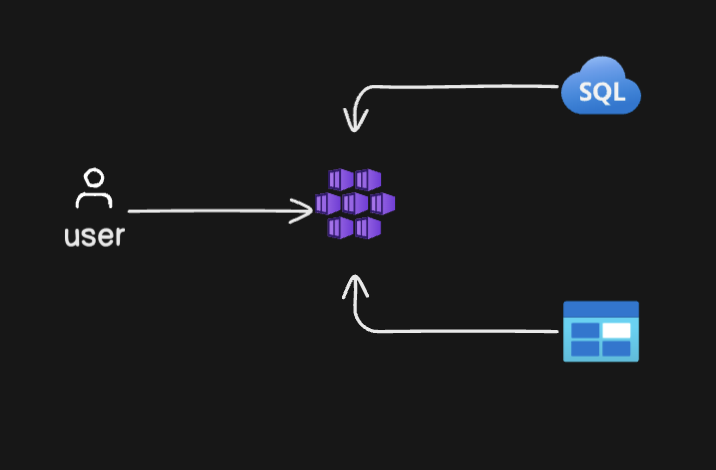

# Cloud web-app deployment

The application should:

	•	Display a list of manhwa titles, their genres, and brief descriptions using mock data (e.g., a JSON file).
	•	Be hosted on a cloud platform (AWS, Azure, or GCP) with a basic infrastructure setup, including:
	•	An EC2 instance or an App Service for hosting.
	•	A storage solution like S3 (AWS) or Blob Storage (Azure) for storing images.
	•	A basic database (e.g., RDS or Cloud SQL) for managing the manhwa data.
	•	Set up auto-scaling for your application so it can handle traffic spikes. Document how auto-scaling is configured and what triggers it (e.g., CPU usage).
	•	Implement security measures by:
	•	Enabling HTTPS for the application using a cloud service (e.g., AWS Certificate Manager or Azure SSL).
	•	Configuring basic firewall rules to restrict access to necessary ports.

### Process
## Node.js CI/CD Pipeline

This repository contains a Node.js application with an automated CI/CD pipeline implemented using GitHub Actions. The pipeline performs the following tasks:

1. **Runs Tests on Pull Requests**: Automatically runs tests to ensure code quality before merging any changes.
2. **Builds a Docker Image**: The Docker image is built from the Node.js application and pushed to Azure Container Registry (ACR).
3. **Deploys to Kubernetes**: The Docker image is deployed to an Azure Kubernetes Service (AKS) cluster.
4. **Includes Notifications**: Notifications are sent for deployment success or failure.

## Requirements
1. **Node.js**: The application is built using Node.js.
2. **Azure Container Registry (ACR)**: For storing the Docker image.
3. **Azure Kubernetes Service (AKS)**: For deploying the application.

## CI/CD Pipeline
The pipeline is defined in the `.github/workflows/deploy.yml` file, and it contains the following steps:

1. **Test Stage**:
   - Runs tests using `npm test`.
   - Automatically triggered on pull requests.

2. **Build Docker Image**:
   - Uses Docker to build the application image.
   - Pushes the image to Azure Container Registry (ACR).

3. **Deploy to Kubernetes**:
   - Uses `kubectl` to apply Kubernetes deployment and service files.

4. **Notification on Success/Failure**:
   - Notifications are sent based on the deployment result.

## Deployment
To deploy the application to Kubernetes:
1. Ensure that the `deployment.yaml` and `service.yaml` files are configured correctly for your cluster.
2. Use `kubectl apply -f k8s/deployment.yaml` and `kubectl apply -f k8s/service.yaml` to deploy.

## Notification Setup
Notifications are integrated into the CI/CD pipeline, notifying the user if the deployment was successful or if there was an error. This can be configured using GitHub Actions notifications or a custom notification system.

## Conclusion
This CI/CD pipeline ensures a smooth workflow from development to production, with automated tests and deployments. It also provides real-time feedback to the team through notifications.

