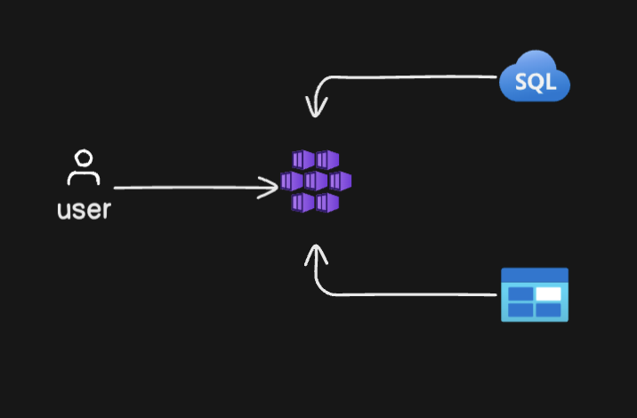
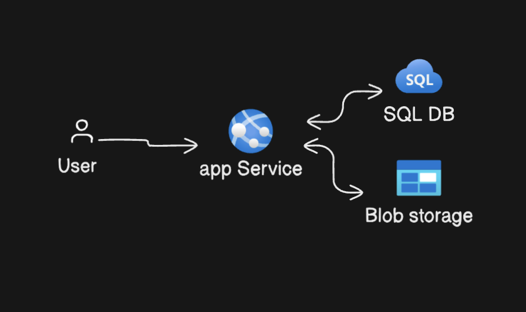

# Cloud web-app deployment

The application should:

	•	Display a list of manhwa titles, their genres, and brief descriptions using mock data (e.g., a JSON file).
	•	Be hosted on a cloud platform (AWS, Azure, or GCP) with a basic infrastructure setup, including:
	•	An EC2 instance or an App Service for hosting.
	•	A storage solution like S3 (AWS) or Blob Storage (Azure) for storing images.
	•	A basic database (e.g., RDS or Cloud SQL) for managing the manhwa data.
	•	Set up auto-scaling for your application so it can handle traffic spikes. Document how auto-scaling is configured and what triggers it (e.g., CPU usage).
	•	Implement security measures by:
	•	Enabling HTTPS for the application using a cloud service (e.g., AWS Certificate Manager or Azure SSL).
	•	Configuring basic firewall rules to restrict access to necessary ports.

### Process
 1.  With azure cli using ARM template 
 2.  Apply the terraform commands and deploy the infrastructure
 3.  Visual guide via portal
#### Extra things
  - I have used the sample data inside insert_data.sql file
  - App service provides ssl automatically
  - For database only the app service outbound ip was used to make it more secure
## 1. Via ARM Templates 
 -  use this command to deploy the infra structure
 -  az deployment group create --resource-group MyResourceGroup --template-file template.json --parameters parameters.json
## 2. With terraform use the terraform scripts (although arm recommended)
 - See main.tf inside Terraform folder
## 3. Visual gide via portal
- https://docs.google.com/presentation/d/1FbxPFlH__1eBkiUiG1t_GBxOmEHlzUogF2BeNS7kIHA/edit?usp=sharing
- or see the pdf in folder az_portal_visual_guide
